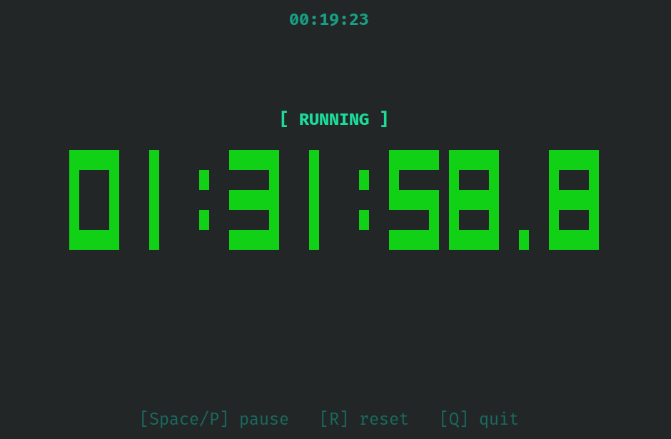

# tty-stopwatch

A terminal stopwatch and countdown timer with a big-digit clock face,
written in modern C++17. In the spirit of [`tty-clock`][1], but for measuring
elapsed time instead of displaying the wall clock.



Unlike the original, this version has **no third-party library dependency**.
The terminal interface is built directly on POSIX primitives (`termios`,
`poll`, `ioctl`, `read`, `write`) plus ANSI/VT100 escape sequences, and
desktop notifications are delivered by speaking the D-Bus wire protocol
directly (Linux) or via the built-in `osascript` bridge (macOS). The result
is a single self-contained binary per target that runs with nothing installed
beyond itself.

[1]: https://github.com/xorg62/tty-clock

## Features

- **Big block-digit display** with automatic horizontal and vertical centering.
- **Stopwatch mode** (counts up indefinitely), **fixed countdown** (`-t`), and
  **wall-clock countdown** (`-u`/`--until`) that runs until the next occurrence
  of a given 24-hour time of day.
- **Tenths on screen, centiseconds on exit.** The clock face shows time to a
  single decimal (tenths) and only repaints when that visible value changes,
  which keeps idle CPU usage minimal; the measurement itself stays exact and
  the final `stdout` line is printed at full `HH:MM:SS.cs` precision.
- **Pipe-friendly output**: the final time is written to `stdout`; the big
  clock is drawn on `/dev/tty`, so output redirection works.
- **Desktop notifications with no packages.** When a countdown finishes the
  program raises a native notification (D-Bus on Linux, `osascript` on macOS)
  and rings the terminal bell as a universal fallback.
- **Many display modes**: hide hours, seconds-only, blinking colons, optional
  system clock at the top, monochrome.
- **Screensaver mode** with a 0.5 FPS refresh and quit-on-keypress.
- **Auto-launches a terminal** when double-clicked from a graphical file
  manager (Linux only).
- **Compact text fallback** when the terminal is too small for the big digits;
  switches back automatically when there's room.
- **No locale dependency.** All rendering uses ASCII; output uses 24-hour
  numeric time and never depends on `LANG` / `LC_*`.

---

## Supported platforms (portability sign-off)

This codebase is plain, architecture-independent C++17 over POSIX. It is
explicitly intended to build and run, with no source changes, on the
following two groups:

- **Linux**: amd64 (x86-64), arm64 (aarch64), i386 (x86) and armhf (32-bit ARM). A single
  binary per architecture is designed to run on Alpine-based (musl),
  Debian-based, and Arch-based systems alike, with no extra packages — see
  *Self-contained binaries* below. Desktop notifications work on any desktop
  environment that exposes the standard `org.freedesktop.Notifications`
  service, and degrade to the terminal bell when none is present.
- **macOS**: amd64 (Intel) and arm64 (Apple Silicon). The notification path
  uses the built-in `osascript`, present on every macOS install.

There is no library to match across libc flavors, so the only thing that
distinguishes one Linux binary from another is the CPU architecture it was
compiled for.


### In summary

#### Compatibility acording to my tests by now:

| OS | Architecture | Supported |
|---|---|---|
| Debian / Ubuntu | `amd64`, `i386`, `arm64`, `armhf` | Yes (binary and `*.deb`) |
| Red Hat / Fedora / RHEL | `amd64`, `i386` | Yes |
| Alpine | `amd64`, `i386` | Yes |
| Arch | `amd64`, `i386` | Yes |
| SUSE / OpenSUSE | `amd64`, `i386` | Yes |
| MacOS | Apple Silicone and Intel CPUs | Yes |
| MacOS | `i386` | Shouldn't. Worth trying if you have a 2006 or earlier device. |
| Windows (Windows NT) | Any | No |

---

## Install

### Debian / Ubuntu / Related
If in Debian, Ubuntu or Debian based distro in general:

1. Go to [RELEASES](https://github.com/ljgonzalez1/tty-stopwatch/releases)
2. Download de latest `*.deb` package matching your CPU architecture.
3. Run `sudo dpkg -i tty-stopwatch_<VERSION>_<ARCHITECTURE>.deb`

### The manual way... (other Linux distros and MacOS)
1. Go to [RELEASES](https://github.com/ljgonzalez1/tty-stopwatch/releases)
2. Download de latest binary matching your CPU architecture.
3. Move the binary to where your binaries live `sudo mv tty-stopwatch<WHATEVER> /usr/local/bin/tty-stopwatch`

---

## Updating

### Debian / Ubuntu / Related
If in Debian, Ubuntu or Debian based distro in general:

1. Go to [RELEASES](https://github.com/ljgonzalez1/tty-stopwatch/releases)
2. Download de latest `*.deb` package matching your CPU architecture.
3. Run `sudo dpkg -i tty-stopwatch_<NEW_VERSION>_<SAME_ARCHITECTURE>.deb`

### The manual way... (other Linux distros and MacOS)
1. Delete de old version `sudo rm /usr/local/bin/tty-stopwatch`
2. Go to [RELEASES](https://github.com/ljgonzalez1/tty-stopwatch/releases)
3. Download de latest binary matching your CPU architecture.
4. Move the binary to where your binaries live `sudo mv tty-stopwatch<WHATEVER> /usr/local/bin/tty-stopwatch`

---

## Building: Build dependencies

To **run** the binary you need nothing beyond the binary itself. The packages
below are required only to **compile** it: a C++17 compiler and GNU make. No
`ncurses`, no `libnotify`, and no development headers are needed.

### Debian / Ubuntu (and other apt-based distributions)

Install the compiler toolchain and make:

```bash
sudo apt update
sudo apt install build-essential
```

`build-essential` already provides `g++` and `make`. Nothing else is required.

Building a `.deb` with `make deb` (see below) needs nothing extra either: the
`dpkg` package is the only requirement, and it ships with every Debian-based
system. No `dpkg-dev`, `debhelper`, or `build-essential` add-on is involved.

### Fedora / RHEL / openSUSE (and other rpm-based distributions)

Install a C++ compiler and make:

```bash
sudo dnf install gcc-c++ make
```

(On openSUSE use `sudo zypper install gcc-c++ make`.)

### Arch (and Arch-based distributions)

Install the base development group, which includes `gcc` and `make`:

```bash
sudo pacman -S base-devel
```

### Alpine (and other musl-based distributions)

Install the compiler and make:

```bash
sudo apk add g++ make
```

Alpine is also the most convenient place to produce a fully static binary;
see *Self-contained binaries* below.

### macOS (amd64 and arm64)

The dependencies are identical on both Intel and Apple Silicon: only the Xcode
Command Line Tools, which provide `clang++` and `make`.

```bash
xcode-select --install
```

There is no extra package to install for notifications on either architecture;
`osascript` ships with the operating system.

---

## Build and install

```bash
git clone https://github.com/ljgonzalez1/tty-stopwatch
cd tty-stopwatch
make
sudo make install
```

On Linux this installs `tty-stopwatch` to `/usr/bin/`. On macOS it installs to
`/usr/local/bin/`. To pick a different prefix:

```bash
sudo make install PREFIX=/opt/local
```

To remove the installed binary:

```bash
sudo make uninstall
```

To clean intermediate build artifacts:

```bash
make clean
```

### Self-contained binaries

The default `make` produces a dynamically linked binary that depends only on
the system C/C++ runtime. To obtain a binary you can copy to other machines of
the same architecture without installing anything:

```bash
# Linux, recommended for maximum portability: fully static (build on Alpine
# or with a musl cross-toolchain). Runs on Alpine, Debian, and Arch alike.
make static          # equivalent to: make STATIC=1

# Linux, glibc hosts: keep a dynamic libc but bundle the C++ runtime, so the
# target does not need a matching libstdc++.
make portable        # equivalent to: make PORTABLE=1

# macOS: one universal binary for both Intel and Apple Silicon.
make macos-universal # equivalent to: make MACOS_UNIVERSAL=1
```

A fully static build is cleanest on musl (Alpine) because the program uses no
name-service (NSS) facilities; the resulting executable carries everything it
needs.

### Debian package (`.deb`)

On a Debian-based system you can build a native `.deb` and manage it with the
normal package tools. Building the package needs no root and no extra
packages — only `dpkg`, which is always present (version 1.19 or newer, i.e.
Debian 10+ / Ubuntu 18.10+, so that file ownership can be recorded without
elevated privileges):

```bash
make deb
```

This writes `dist/tty-stopwatch_1.1.0-1_<arch>.deb`, where `<arch>` is the
architecture of the build host as reported by `dpkg --print-architecture`
(`amd64`, `arm64`, or `armhf`). The package installs the binary to
`/usr/bin/tty-stopwatch`, exactly like `make install`, and includes the usual
`copyright` and `changelog.Debian.gz` under `/usr/share/doc/tty-stopwatch/`.
Install and remove it the same way as any package from the archive:

```bash
sudo apt install ./dist/tty-stopwatch_1.1.0-1_amd64.deb   # match your arch
sudo apt remove tty-stopwatch
```

`make deb` itself does not require `sudo`; only the `apt` install and remove
steps do. The packaged binary links the C++ runtime statically and declares a
dependency only on `libc6`, so it runs on any Debian-based release of the same
architecture. (If `make deb` is ever run under `sudo`, the `dist/` and `build/`
directories and the built binary are handed back to the invoking user, so
nothing in the working tree is left owned by root.)

---

## Usage

```text
tty-stopwatch [options]

Options:
    -h, --help              Show help and exit.
    -t, --timer DURATION    Run as countdown timer for DURATION.
    -u, --until HH:MM[:SS]  Count down to the next occurrence of a 24h time.
    -r, --reverse           Show timer counting up instead of down (requires -t or -u).
    -H, --no-hour           Hide hours; minutes grow without bound.
    -S, --seconds-only      Show seconds only, growing without bound.
    -B, --blink             Blink the colon separators each second.
    -c, --clock             Show a small system clock at the top.
    -n, --no-color          Render in monochrome.
    -q, --quit-on-press     Exit on any non-control key.
    -s, --screensaver       0.5 FPS refresh; implies -q and -a.
    -a, --no-output         Do not print the final time on exit.

Controls:
    SPACE, P                Pause / resume.
    R                       Reset to zero (paused).
    Q, Ctrl+C               Exit.
```

The stopwatch starts running automatically.

### Duration syntax (`-t`)

A duration combines hour (`h`), minute (`m`), and second (`s`) units in any
order, with no spaces. Both upper- and lower-case unit letters are accepted.

| Input         | Meaning                                |
|---------------|----------------------------------------|
| `-t 1h30m45s` | 1 hour, 30 minutes, 45 seconds         |
| `-t 90s`      | 90 seconds                             |
| `-t 5m`       | 5 minutes                              |
| `-t 2h`       | 2 hours                                |
| `-t 30m5h`    | 5 hours, 30 minutes (any order)        |
| `-t 1H30M`    | 1 hour, 30 minutes (case-insensitive)  |

Durations of zero or with a trailing bare number (e.g. `1m30`) are rejected.

### Wall-clock target (`-u` / `--until`)

Instead of a length, you can give a **time of day** in 24-hour form and let the
program count down to the next time the clock reaches it. If the time has
already passed today, the target automatically rolls over to tomorrow.

| Input              | Meaning                                            |
|--------------------|----------------------------------------------------|
| `-u 20:32`         | Count down to the next 20:32 (today or tomorrow)   |
| `--until 06:00:00` | Count down to the next 06:00:00                    |
| `-u 9:05`          | Hours may be given without a leading zero          |

The remaining time is computed from the system clock at start-up, to
sub-second precision, and the timer fires (with a notification) the moment the
target time is reached. `-t` and `-u` cannot be combined.

### Output format

On exit, the program writes one line to `stdout` in `HH:MM:SS.cs` format (two
decimal places, i.e. centiseconds). The on-screen clock shows only tenths, but
the printed value is always at full precision. The `HH` field is at least two
digits and grows naturally beyond 99 if needed.

- In **stopwatch mode**, the elapsed time is printed.
- In **countdown mode** (`-t` or `-u`):
  - If the timer **finished naturally**, the **original countdown length** is
    printed.
  - If the timer was **interrupted** (Q, Ctrl+C, SIGTERM, etc.), the **elapsed
    time** is printed instead.
- The `-a` / `--no-output` flag suppresses this output entirely.

```bash
# Five-minute Pomodoro; capture the resulting duration
duration=$(tty-stopwatch -t 5m)
echo "Worked for $duration"

# Count down to 18:00 and capture how long that turned out to be
remaining=$(tty-stopwatch -u 18:00)

# The big clock still renders on the terminal while stdout is redirected
tty-stopwatch -t 1m > timer.log
```

### Flag bundling

Short flags can be combined freely. The bundle is parsed left to right; `-t`
and `-u` each consume the rest of the current token (if any) or the next
argument as their value:

```bash
tty-stopwatch -nBc -t 5m        # -n -B -c -t 5m
tty-stopwatch -nBct 5m          # same as above
tty-stopwatch -nBct5m           # same again, value joined to -t
tty-stopwatch -nu 20:32         # -n -u 20:32
tty-stopwatch -nu20:32          # value joined to -u
tty-stopwatch --blink -nc       # mix of long and short forms
tty-stopwatch -n -n -n -B       # redundancy is fine
```

Unknown flags, malformed durations or times, and contradictory combinations
(`-H` together with `-S`, `-t` together with `-u`, or `-r` without either
`-t` or `-u`) print the help screen to stderr and exit with status 1. `-h`,
`--h`, and `--help` take precedence over any other validation, including
errors.

### Examples

```bash
tty-stopwatch                          # plain stopwatch
tty-stopwatch -t 5m                    # 5-minute countdown
tty-stopwatch -u 20:32                 # count down to the next 20:32
tty-stopwatch -t 1h30m -c -B           # 90-minute timer + clock + blink
tty-stopwatch -t 30s -r                # 30s timer shown counting up
tty-stopwatch -nS                      # monochrome, seconds only
tty-stopwatch -s -t 25m                # screensaver-style Pomodoro
elapsed=$(tty-stopwatch -t 10s)        # capture into a variable
```

---

## Behaviour notes

### Double-click launches (Linux only)

When `tty-stopwatch` is started without a controlling terminal — for example
by double-clicking the binary in a graphical file manager — it re-executes
itself inside the system's preferred terminal emulator. The following
terminals are tried, in order:

`x-terminal-emulator`, `gnome-terminal`, `konsole`, `xfce4-terminal`,
`mate-terminal`, `lxterminal`, `alacritty`, `kitty`, `terminator`, `tilix`,
`xterm`.

The terminal window closes as soon as `tty-stopwatch` exits. On macOS this
feature is intentionally disabled; run the program from Terminal.app, iTerm2,
or any other terminal you prefer.

### Resizing and small terminals

The terminal size is re-queried every frame, so resizing the window or
changing font size always recenters the clock without relying on `SIGWINCH`.
If the terminal becomes too small to hold the big-digit clock, the program
falls back to a single line of plain text showing the current time, and
switches back to the big display automatically once there's room again.

### Notifications

When a countdown timer completes, the program issues:

1. A terminal bell (`\a`) written directly to `/dev/tty`.
2. On Linux, a desktop notification sent over the session D-Bus to
   `org.freedesktop.Notifications`, spoken on the wire with no `libnotify` or
   `notify-send` dependency.
3. On macOS, a notification via the built-in `osascript`.

Every step is best-effort and silent: a missing notification service causes no
error and nothing leaks onto the rendered screen. The bell always fires, so
there is always at least one signal.

---

## Still missing, usefull or fun features
- Ability to change colors
- Animated background(?)
- Add icon for notifications
- Remove restriction minutes < 60 ; seconds < 60. Should allow for example: `tty-stopwatch -t 300m700s` and do the math
- Add days to the mix (`tty-stopwatch -t 10d`)


